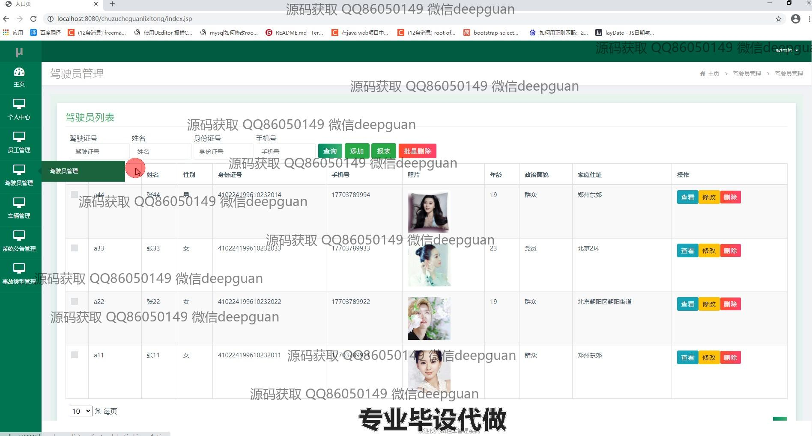
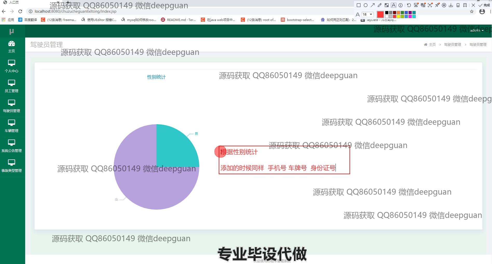

<h1 align="center">基于HTML的出租车管理系统</h1>

## 简介
出租车管理系统：角色分为管理员和员工；功能涵盖司机管理、车辆管理、订单处理、事故管理、统计分析等，支持实时位置跟踪和年审管理，界面简洁，操作便捷。    --计算机毕业设计源码；毕设源码；java毕业设计源码

## 联系方式

<h3 align="center">获取完整代码与数据库文件 + 微信：deepguan QQ: 86050149 QQ群: 783742310</h3>

<h3 align="center">可帮忙远程部署 包运行成功！提供远程部署、修改代码、设计文档指导、代码讲解等服务！</h3>

## 功能介绍（完整见运行截图）
管理员：提供登录、注册和用户角色选择功能。具备对员工、驾驶员和车辆的信息管理权限，包括添加、修改和删除操作。可以查看、处理和管理订单以及统计运营数据。具备对事故类型和系统公告的管理功能，确保信息及时更新。管理员也可以查看和生成各种报表，以支持业务决策。

员工：可通过系统进行个人信息管理，如修改姓名、手机号码、身份证号等。负责维护和更新车辆及年审相关信息，上传年审文件。员工可查看系统公告和领导下达的任务或安排。具备基本的订单查看和处理能力，协助管理员提升运营效率。

驾驶员：提供个人信息管理功能，支持更新如驾驶证号、联系方式及住址等信息。具备查看工作安排、车辆信息和系统公告的权限。支持上传个人文件及照片，方便进行身份验证和信息核实。驾驶员可以查看并处理与自己相关的订单与工作安排。

用户：用户可以通过系统注册并登录查看个人中心。用户可以查看个人信息和行程记录及订单历史，并能对系统中保存的地址进行管理。用户通过地图集成功能了解车辆位置及预订情况，确保快速响应和服务调整。提供方便的界面以查询和管理用户与出租车服务相关的所有信息。

## 运行截图

本代码来源于网络,仅供学习参考使用!

